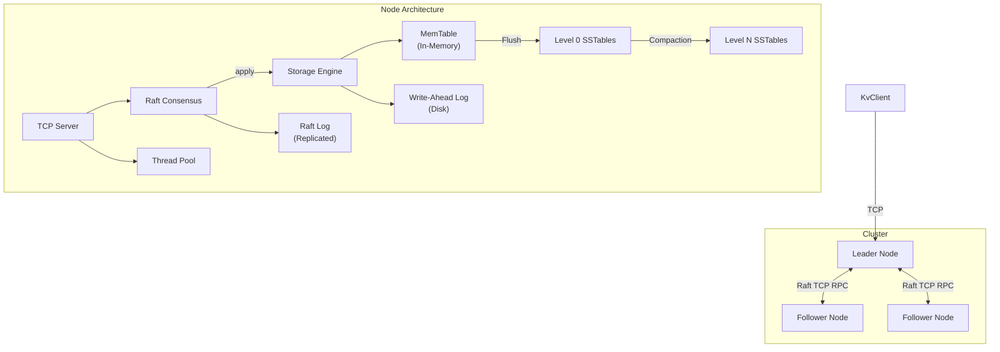

# ShardKV


A C++17 distributed key-value store: LSM storage, Raft consensus, and a custom TCP protocol.

See [docs/architecture.md](docs/architecture.md) and [docs/protocol.md](docs/protocol.md).

## Features

- **LSM-Tree Storage Engine**: MemTable → WAL → SSTable architecture optimized for write-heavy workloads
- **Crash-safe durability**: acknowledged writes are on stable media before the write returns, with group commit so concurrent writers share the cost of a sync
- **Bloom Filters**: Probabilistic membership testing to reduce unnecessary disk reads
- **Leveled Compaction**: Background merging with tombstone cleanup and duplicate removal
- **Raft Consensus**: Fault-tolerant leader election and log replication, with term, vote and log entries persisted before they are acted on
- **Pre-Vote and CheckQuorum**: a partitioned or rejoining node cannot inflate its term and depose a healthy leader, and a leader that loses its quorum steps down on its own
- **Leader-based writes**: a write returns only once its Raft entry is committed and applied
- **Strongly consistent reads (default)**: GET is served by a leader that has confirmed its quorum; `SHARD_ALLOW_STALE_READS` opts into local stale reads
- **TCP protocol**: length-prefixed binary framing for client KV and node-to-node Raft RPCs (not HTTP/gRPC)
- **Bounded thread pool**: request handlers run on a fixed worker set with a bounded queue and `OVERLOADED` backpressure

The in-tree web dashboard still uses leftover gRPC stubs and does **not** speak this TCP protocol. Do not treat it as a working client.

## Architecture



## Dashboard & Visualization

The project includes a comprehensive web dashboard to visualize the internal state of the cluster.

**To run:** `cd dashboard && python3 server.py` → Open http://localhost:8006

### Test Scenarios

The dashboard features interactive scenarios to validate system behavior:

| Scenario | Description |
|----------|-------------|
| **📝 Basic CRUD** | Verifies fundamental operations: PUT a value, GET it back, then DELETE it. |
| **⚡ Batch Write** | Tests throughput by dispatching 100 parallel write requests to the cluster. |
| **🔄 Consistency** | "Read-your-writes" verification. Writes a value and immediately reads it back. The write returns only after its Raft entry is committed and applied, and the read is served by a leader that has re-confirmed its quorum. |
| **🎲 Random Load** | Simulates realistic traffic with a mixed workload (60% writes, 40% reads) to test stability. |
| **💥 Leader Failover** | Chaos engineering test. Forcefully stops the current leader node to demonstrate Raft fault tolerance. Watch as surviving nodes detect failure, hold an election, and pick a new leader. |

## Quick Start

### Prerequisites

- CMake 3.16+
- C++17 compiler (GCC 9+, Clang 10+, or MSVC)
- pthread / Windows sockets (linked automatically)
- Docker (optional, for a 3-node compose cluster)

### Building & Running

**Docker (Recommended for Cluster):**

```bash
# Build and start the 3-node cluster
docker-compose up --build --remove-orphans

# Nodes listen on host ports 7071, 7072, 7073 (TCP, not HTTP)
```

**Manual Build:**

```bash
git clone https://github.com/yourusername/shard-kv.git
cd shard-kv

# Build
cmake -B build -DCMAKE_BUILD_TYPE=Release
cmake --build build --parallel

# Run tests
cd build && ctest --output-on-failure
```

## Configuration

All configuration is done via environment variables:

| Variable | Default | Description |
|----------|---------|-------------|
| `SHARD_NODE_ID` | `1` | Unique node identifier |
| `SHARD_LISTEN_ADDR` | `0.0.0.0:7070` | TCP listen address (`host:port`) |
| `SHARD_THREAD_POOL_SIZE` | `4` | Request-handler worker threads |
| `SHARD_REQUEST_QUEUE_SIZE` | `1000` | Bounded handler queue; excess KV requests return `OVERLOADED` |
| `SHARD_MAX_CONNECTIONS` | `256` | Cap on concurrent TCP connections |
| `SHARD_MAX_PAYLOAD_BYTES` | `16777216` | Max framed payload |
| `SHARD_PEERS` | `` | Comma-separated peer addresses |
| `SHARD_HEARTBEAT_MS` | `50` | Leader heartbeat interval |
| `SHARD_WAL_SYNC` | `group` | Durability policy: `group`, `always`, or `none` |
| `SHARD_COMMIT_TIMEOUT_MS` | `5000` | How long a write waits to be committed and applied |
| `SHARD_ALLOW_STALE_READS` | `false` | Serve reads without confirming leadership |
| `SHARD_LOG_LEVEL` | `INFO` | Logging verbosity |

## Testing Strategy

The project verifies correctness at two levels:

### 1. Dashboard Tests (System Level)
Visualized in the web UI -> Open http://localhost:8006
- **Result**: Validates end-to-end behavior, clustering, and Raft consensus.
- **Scenarios**: Basic CRUD, Batch Write, Consistency, Leader Failover.

### 2. Unit Tests (Component Level)
Run in terminal -> `cd build && ctest`
- **Result**: Validates internal data structures and logic in isolation.
- **Coverage**:

| Component | Test File | Scenarios Covered |
|-----------|-----------|-------------------|
| **Bloom Filter** | `test_bloom_filter` | False positive rate, serialization, existence checks. |
| **MemTable** | `test_memtable` | Put/Get, tombstones for deletes, sorting order. |
| **WAL** | `test_wal` | Durability across a process crash, group-commit batching, sync modes, segment rotation, checksum validation. |
| **SSTable** | `test_sstable` | Concurrent point lookups and scans, reads surviving file unlink, rejection of truncated files. |
| **Compaction** | `test_compaction` | Level-0 recency ordering, flush racing a compaction, tombstone collection. |
| **Raft Log** | `test_raft_log` | Appending, truncation, conflict resolution, durable persistence, torn and corrupt tails. |
| **Raft State** | `test_raft_state` | Term and vote surviving a crash; no double-voting in a term. |
| **Raft Cluster** | `test_raft_cluster` | In-process 3-node cluster with partitionable, directional links: election, commit acknowledgement, failover, pre-vote, check quorum, heartbeat cadence. |
| **Command** | `test_command` | Encode/decode round-trips, delimiters in keys, malformed input. |
| **Storage** | `test_storage_engine` | Integration of MemTable+WAL+SSTables, concurrent traffic, durability across flush. |
| **Protocol** | `test_protocol` | Binary encode/decode, framing, buffer underflow. |
| **TCP KV** | `test_tcp_kv` | Single-node TCP PUT/GET/DELETE/PING and concurrent clients. |

## API Reference

Client and peer traffic uses the TCP frames in [docs/protocol.md](docs/protocol.md).

Supported operations: `PING`, `GET`, `PUT`, `DELETE`, plus Raft `RequestVote` and `AppendEntries`. There is no Scan RPC on the TCP path yet (`StorageEngine::scan` exists locally).

## Durability & Consistency

What the system guarantees, and what it costs.

### Durability

A write is acknowledged only after its WAL record is on stable media. "Stable
media" is meant literally: on macOS `fsync()` returns once the data reaches the
drive, which may still hold it in a volatile write cache, so `F_FULLFSYNC` is
used there. Linux uses `fdatasync()`.

Syncing is expensive and a single sync covers every byte written so far, so
concurrent writers **group commit**: the first writer to find no sync in flight
performs one on behalf of every record already written, and the others wait
until the synced watermark passes their own. Nobody returns early: the batching
reduces the number of syncs, never the guarantee.

SSTables are built under a temporary name and installed with fsync + rename, and
a WAL segment is deleted only after the SSTable containing its writes is durably
installed. The Raft log and hard state (`currentTerm`, `votedFor`) are likewise
persisted before the node acts on them, since Raft's election-safety argument
assumes a vote survives a crash.

`SHARD_WAL_SYNC=none` disables syncing entirely. It exists for benchmarking and
is **not durable**. Data reaches the page cache only, so it survives a process
crash but not a machine crash.

### Election stability

Two extensions from the Raft dissertation, both standard in production
implementations, address liveness problems the core algorithm has under partial
partitions:

**Pre-Vote.** Before incrementing its term, a candidate runs a trial election
asking only whether it *would* win. A node that cannot win, because it is
partitioned, or because a healthy leader already exists, stays a follower and
leaves its term alone. Without this, an isolated node campaigns repeatedly and
climbs to an ever-higher term (measured here: term 1 to 14 in three seconds);
when it rejoins, that term obliges a working leader to step down. One flapping
node could unseat a healthy cluster indefinitely.

A follower refuses pre-votes outright while a leader is known to be alive,
regardless of the candidate's log. This covers asymmetric partitions, where a
node cannot hear the leader but everyone else can. "A leader is alive" includes
being that leader, a leader that only asks whether it has *heard from* a
leader exempts itself and will help a rejoining node depose it.

**CheckQuorum.** A partitioned leader has nothing arriving to tell it that it
has been deposed, so it must notice on its own: if it has not heard from a
majority within an election timeout, it returns to being a follower.

Replication is driven by one loop per peer, so an unreachable follower cannot
affect how often any other follower is contacted. A single round over all peers
that waits for each of them lets one dead node collapse the heartbeat cadence
seen by healthy ones, measured at a 3x drop, which in turn causes the
spurious elections these mechanisms exist to prevent.

### Consistency

Writes are linearizable. A write is proposed to Raft and returns only once that
entry has been committed and applied to the state machine, and the wait
verifies the entry still carries the proposed term, because a later leader can
reuse the same index for a different entry. The Raft apply loop is the only
writer to the storage engine, so leader and followers follow the identical path.

Reads are strongly consistent by default on the TCP GET path: the node must be
leader and must confirm a quorum (`confirmLeadership`) before reading local
state. That is a ReadIndex-style check. Set `SHARD_ALLOW_STALE_READS=true` to
skip it and read local state on any node, which is faster and not linearizable.

Sharding is not wired into the running server yet. A 3-node compose file starts
one Raft group for the whole keyspace. In-process Raft failover is tested;
multi-process TCP failover is not yet in `ctest`.

### Testing durability honestly

Losing an acknowledged write requires a *machine* crash: a process crash leaves
the OS page cache intact, so data that only reached the page cache still comes
back. That is exactly why a missing `fsync` can go unnoticed: it looks durable
under every test you can write without cutting power.

The suite therefore checks two things it genuinely can: that records leave the
user-space buffer before the acknowledgement (via a `fork` + `_exit` child that
skips every destructor and buffer flush), and that a real sync call is issued
before the acknowledgement, with concurrent writers batching. True power-loss
testing needs filesystem fault injection, which these tests do not attempt and
do not claim.

## Performance

Measured on this machine (Apple Silicon, 4-core, local SSD) with
`bench_throughput`, 100-byte values.

Durability dominates write throughput, so the sync mode is stated with every
number. `none` is included only to show what the sync actually costs.

### Writes

| Sync mode | Writers | Throughput | Durable? |
|-----------|---------|------------|----------|
| `none` | 4 | 143,853 ops/s | **No**, page cache only |
| `none` | 16 | 130,202 ops/s | **No**, page cache only |
| `always` | 4 | 274 ops/s | Yes, one sync per write |
| `group` | 1 | 262 ops/s | Yes |
| `group` | 4 | 530 ops/s | Yes |
| `group` | 16 | 2,128 ops/s | Yes |
| `group` | 32 | 4,021 ops/s | Yes |

Roughly 269 syncs/s is this drive's `F_FULLFSYNC` rate, measured directly, and it
is the ceiling for a single writer. The WAL reaches 262/s single-threaded, so it
is running at 97 percent of what the hardware allows and the remaining cost is
the sync itself rather than anything above it. `always` stays flat there no matter how many writers there are.
`group` scales past it because the syncs are shared: the number of syncs stays
roughly constant while the number of writes rises, so 32 writers get ~15x the
throughput of one.

### Reads

| Writers | Throughput |
|---------|------------|
| 4 | ~350,000 ops/s |
| 16 | ~386,000 ops/s |

Reads are unaffected by sync mode. These figures are for a dataset that fits in
the MemTable; reads served from SSTables pay a `pread` and a block CRC check.

### Where the durability cost comes from

Measured on this machine with a 128-byte append, isolated from the rest of the
engine:

| | ms per write | writes/sec |
|---|---:|---:|
| no sync | 0.0021 | 478,011 |
| `fsync` | 0.0200 | 50,084 |
| `F_FULLFSYNC` | 3.7223 | 269 |

That 1,779x span between the first and last row is the entire difference between
the old published figure and the current one. The old benchmark never left the
page cache.

The middle row is the trap. On macOS `fsync` returns once data reaches the drive,
which is free to hold it in a volatile cache, so it is 186 times faster than
`F_FULLFSYNC` while providing no protection against power loss. Code ported from
Linux calls `fsync` and looks durable under every test that can be run without
cutting power.

> **On the previously published figures.** This README used to claim 206,825
> writes/s and 715,877 reads/s. The write number was measured with no `fsync`
> anywhere in the codebase, so it describes `none` mode above. The read number
> drew keys from a space ten times larger than the dataset, so roughly 90% of
> those "reads" were bloom-filter rejections of keys that had never been
> written. Both have been corrected rather than quietly dropped.

## Correctness

Most fixes here ship with a test that was confirmed to fail against the previous
behaviour, so the regression is demonstrable rather than asserted.
[docs/correctness.md](docs/correctness.md) records what each defect was, what
changed, and which test pins it, including the two durability tests that pass but
were not confirmed to fail and the gaps that remain.

The suite runs clean under both ThreadSanitizer and AddressSanitizer with UBSan:

```bash
cmake -B build-tsan -DCMAKE_BUILD_TYPE=Debug -DSHARD_SANITIZE=thread && cmake --build build-tsan --parallel && ctest --test-dir build-tsan --output-on-failure
```

Properties under test:

- an acknowledged write survives a process crash, and a real sync precedes it
- concurrent readers of one SSTable never observe each other's blocks
- level 0 returns the newest version of a key, across restarts
- a flush landing mid-compaction is not discarded
- a tombstone is not dropped while an older version survives at a deeper level
- a granted vote survives a crash, so a node cannot vote twice in one term
- a partitioned leader does not acknowledge writes it cannot commit
- a torn or corrupt Raft log tail loads its valid prefix instead of crashing
- an isolated node does not inflate its term, and does not depose the leader on
  rejoining
- an asymmetric partition does not unseat a leader that is serving the rest of
  the cluster
- a leader that cannot reach a quorum steps down without being told
- one unreachable follower does not change how often healthy followers are
  contacted

## Contributing

`script/check_prose.rb` enforces the authoring rules on the tracked tree and on
commit messages. Run it before committing:

```bash
ruby script/check_prose.rb
```

## Limitations

Stated plainly, because they are the questions a reader should ask next.

- **No snapshotting or log compaction.** The Raft log grows without bound, so a
  long lived cluster accumulates entries indefinitely.
- **Fixed membership.** The cluster is configured at startup. There is no joint
  consensus and no single server membership change.
- **No sharding in the running server.** `ShardManager` is not wired up; every
  key lives in one Raft group.
- **Durability is verified indirectly.** The tests confirm a sync is issued
  before the acknowledgement, not that the data survives power loss. Proving the
  latter needs filesystem fault injection.
- **Reads use a leadership quorum check, not a leader lease.** Every strongly
  consistent read costs a quorum round trip (trivial on a single node).
