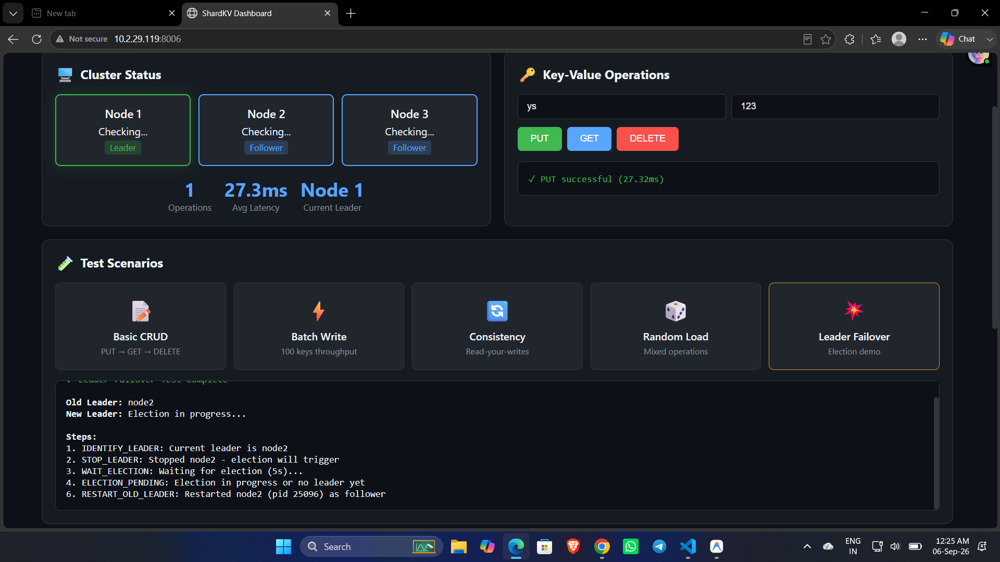

# ShardKV



ShardKV is a high-performance, fault-tolerant, and strongly consistent distributed key-value store written in C++17. It marries a high-throughput **Log-Structured Merge (LSM)** storage engine with a **Raft consensus module**, and communicates over a custom multiplexed **TCP protocol**.

## Documentation Links

- 🏛️ **[Architecture Deep Dive](docs/architecture_deep_dive.md)** - Detailed explanation of the system components.
- ⚙️ **[Protocol Definition](docs/protocol.md)** - Binary TCP protocol specifications.
- 🛡️ **[Correctness & Testing](docs/correctness.md)** - Edge cases, durability constraints, and test suite details.

---

## 🌟 Core Features in Detail

### 1. Modern C++17 Architecture
Built entirely in C++17, ensuring memory safety, high performance, and minimal overhead. Uses cross-platform standard libraries alongside native platform optimizations (like `OVERLAPPED` I/O on Windows) to maximize throughput.

### 2. Custom TCP Protocol
Instead of relying on heavy HTTP or gRPC libraries, ShardKV implements a custom **length-prefixed binary TCP protocol**. 
- **Multiplexing:** The TCP server handles both client KV traffic (GET, PUT, DEL) and node-to-node Raft RPCs (RequestVote, AppendEntries) over the same connections.
- **Backpressure:** A bounded thread pool caps resource usage; if the request queue fills up, the server sheds load by returning `OVERLOADED` instantly.

### 3. Log-Structured Merge (LSM) Storage Engine
The local storage layer is heavily optimized for write-heavy workloads using an LSM architecture.
- **Write-Ahead Log (WAL):** Every local write is appended to a WAL for process-crash durability. Sync behavior is configurable (e.g. `group` commit batches syncs across concurrent threads to massively boost throughput).
- **MemTable:** Writes are staged in a fast in-memory SkipList.
- **SSTables (Sorted String Tables):** Once full, the MemTable flushes to disk as an immutable SSTable, completely eliminating read locks.
- **Bloom Filters:** Each SSTable has an in-memory Bloom filter. This probabilistic data structure tells the engine instantly if a key is absent, saving thousands of unnecessary disk reads.
- **Leveled Compaction:** Background threads merge smaller overlapping SSTables into larger ones, purging deleted keys (tombstones) and reclaiming disk space.

### 4. Raft Distributed Consensus
High availability and fault tolerance are driven by a fully integrated Raft module.
- **Leader Election:** If the current leader crashes or is partitioned, followers hit an election timeout and elect a new leader.
- **Pre-Vote & CheckQuorum:** Advanced Raft extensions. "Pre-Vote" prevents a partitioned node from artificially inflating its term and disrupting the cluster when it heals. "CheckQuorum" forces a leader to step down immediately if it loses touch with a majority of the cluster.
- **Log Replication:** Writes are appended to the Raft log and replicated to followers via `AppendEntries`. Only when a quorum acknowledges the write is it committed and applied to the state machine.

### 5. Crash Recovery & Durability
ShardKV handles sudden machine crashes through dual-log recovery.
- **Hard State Persistence:** Crucial Raft metadata (Current Term, Voted For) is synced to disk instantly.
- **Dual Replay:** On startup, the node replays its persistent **Raft Log** to catch up with cluster consensus, and replays its **WAL** to recover unflushed MemTables.

---

## 🔄 System Flow: The Journey of a `PUT` Request

1. **Client Request:** A client sends a `PUT key value` TCP packet to any node in the cluster.
2. **Routing:** If the receiving node is not the Leader, it rejects the request (or returns a `NOT_LEADER` redirect). If it is the Leader, it accepts the write.
3. **Raft Proposal:** The Leader appends the command to its replicated Raft Log.
4. **Replication:** The Leader issues `AppendEntries` RPCs to all Follower nodes.
5. **Commit:** Once a majority of nodes (quorum) respond, the Leader considers the entry committed.
6. **Application (LSM):** The Leader applies the committed entry to the local Storage Engine:
   - Appends it to the WAL (Write-Ahead Log) on disk.
   - Inserts it into the in-memory MemTable.
7. **Response:** The Leader returns a success TCP packet to the client.

---

## 📊 Dashboard & Visualization

The project includes a comprehensive web dashboard (written in Python) to visualize the internal state of the cluster, monitor elections, and test operations in real-time.

**To run the dashboard:** 
```bash
cd dashboard
python server.py
```
Then open http://localhost:8006 in your browser.

### Interactive Test Scenarios
- **📝 Basic CRUD:** Verifies fundamental operations: PUT a value, GET it back, then DELETE it.
- **⚡ Batch Write:** Tests throughput by dispatching 100 parallel write requests to the cluster.
- **🔄 Consistency:** "Read-your-writes" verification. Writes a value and immediately reads it back, ensuring strict consistency.
- **🎲 Random Load:** Simulates realistic traffic with a mixed workload (60% writes, 40% reads) to test stability.
- **💥 Leader Failover:** Forcefully stops the current leader node to demonstrate Raft fault tolerance. Watch as surviving nodes detect failure, hold an election, and pick a new leader.

---

## 🚀 Quick Start

### Prerequisites
- CMake 3.16+
- C++17 compiler (GCC 9+, Clang 10+, or MSVC)
- Windows PowerShell (for local cluster execution)

### Starting a Local Cluster (Windows)
We provide a PowerShell script that instantly builds the project and spawns a 3-node local cluster.

```powershell
# Run the local cluster script
.\scripts\start_cluster.ps1
```
The nodes will start on ports `7071`, `7072`, and `7073`.

### Manual Build
```bash
cmake -B build -DCMAKE_BUILD_TYPE=Release -DBUILD_TESTS=OFF
cmake --build build --parallel
```

---

## ⚙️ Configuration

All configuration is done via environment variables:

| Variable | Default | Description |
|----------|---------|-------------|
| `SHARD_NODE_ID` | `1` | Unique node identifier |
| `SHARD_LISTEN_ADDR` | `0.0.0.0:7070` | TCP listen address (`host:port`) |
| `SHARD_THREAD_POOL_SIZE` | `4` | Request-handler worker threads |
| `SHARD_REQUEST_QUEUE_SIZE` | `1000` | Bounded handler queue; excess KV requests return `OVERLOADED` |
| `SHARD_MAX_CONNECTIONS` | `256` | Cap on concurrent TCP connections |
| `SHARD_PEERS` | `` | Comma-separated peer addresses |
| `SHARD_WAL_SYNC` | `group` | Durability policy: `group`, `always`, or `none` |
| `SHARD_ALLOW_STALE_READS` | `false` | Serve reads without confirming leadership |

## 🧪 Testing

The test suite covers everything from low-level storage data structures to in-process distributed clustering.

To run the unit and integration tests:
```bash
cmake -B build -DBUILD_TESTS=ON
cmake --build build --parallel
cd build
ctest --output-on-failure
```
